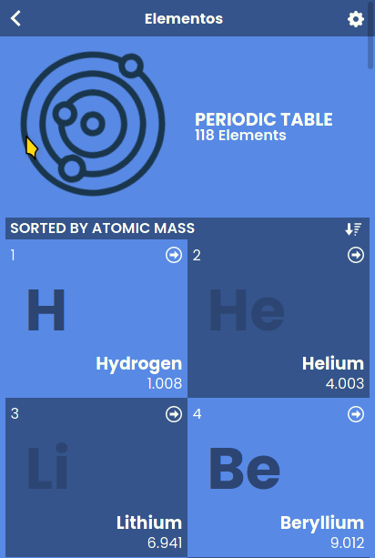
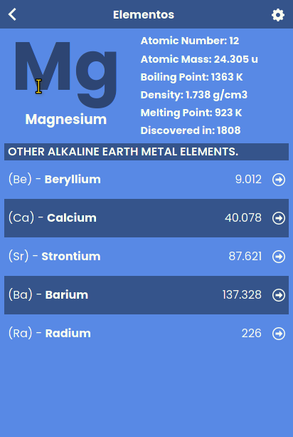

# Elementos - React/Redux Microverse Capstone Project

> Elementos is a web-based application that allows you to explore periodic table elements. 

It features two pages, the home page, and the details page. On the first page, you'll see a list with all the periodic table elements. When you click on any element this will redirect you to the details page where more data will be available.

## Screenshots



## Live Version

There is a live version available in [ad9311-elementos](https://ad9311-elementos.netlify.app/)

## Built With

- 
- 

## Getting Started

### Prerequisites

- [Node.Js](https://nodejs.org/en/)
- [NPM](https://docs.npmjs.com/downloading-and-installing-node-js-and-npm/) OR
- [Yarn](https://classic.yarnpkg.com/en/docs/install/#debian-stable)

To get started, first, clone this project by using the following command:

```
git clone https://github.com/ad9311/elementos.git
```

Then change directory into the root folder `cd elementos`</br>
**NOTE:** The `create-react-app` command used to create this application uses `yarn` as its default package manager. I suggest using `yarn` for consistency, but if that does not work, you can use `npm`. Also, note that running `npm` will create a "package-lock.json" file which may conflict with the already existing "yarn.lock" file.</br>

Before launching the application, you will need to run a few commands:</br>

`yarn install` or `npm install`

Then launch the application with:</br>

`yarn start` or `npm start` this will open a tab in your broswer. Wait until the application loads completely.

### Build

The application can load faster if you build it. Follow these steps:</br>
First, run `yarn build` or `build run build`</br>

Then serve the build with:</br>

`yarn global add serve` or `npm install -g serve` then `serve -s build`

This will open the server and a message similar to the one below will appear in the console:</br>
```
Serving!                                              
                                                     
      - Local:            http://localhost:5000      
      - On Your Network:  http://192.168.0.20:5000   
                                                     
      Copied local address to clipboard!
```
Use the link from your clipboard to open the application.

### Contributing

Contributions, issues and, feature requests are welcome!

You can do it on [issues page](https://github.com/ad9311/elementos/issues).

## Show your support

Give a ⭐️ if you like this project!

## Acknowledgments

- Special thanks and credits to [Nelson Sakwa](https://www.behance.net/sakwadesignstudio) for inspiring this project. Check out his project [Ballhead App](https://www.behance.net/gallery/31579789/Ballhead-App-(Free-PSDs))
- [Microverse](https://www.microverse.org/) for international opportunities.
- Icons from [iconmonstr](https://iconmonstr.com/)

## Authors

**Ángel Díaz**

- GitHub: [@ad9311](https://github.com/ad9311)
- Twitter: [@adiaz9311](https://twitter.com/adiaz9311)
- LinkedIn: [Ángel Díaz](https://www.linkedin.com/in/ad9311/)

## Show your support

Give a ⭐️ if you like this project!

## 📝 License

</br>
This project is [MIT](./LICENSE) licensed.
